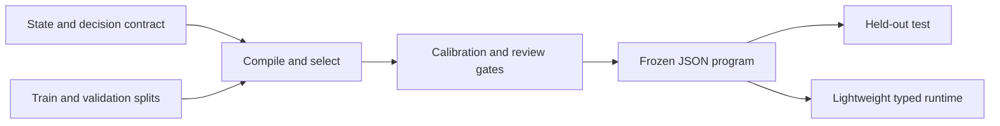

<div align="center">

# System One Compiler

**Declare a decision. Compile typed Jev questions. Measure them. Ship a JSON program.**

  [](LICENSE)

[No-key demo](#run-the-no-key-demo) · [Declaration](#the-declaration) · [Commands](#commands) · [Evaluation](#data-and-evaluation) · [Runtime](#production-shaped-runtime)

</div>

---

A Python 0.1 implementation of a declarative TypeSafe AI/Jev framework, with a
DSPy architect, a standalone GEPA adapter, bounded structural search, separate
policy fitting, and a lightweight runtime. The application developer works with
**state, decisions, labeled examples, and compile**, rather than DSPy internals.

> **Verification boundary:** the bundled no-key demo and core tests were executed.
> The TypeSafe, DSPy, and GEPA integrations are implemented against the documented
> interfaces, but their real packages and live providers were not available in
> the packaging environment. Do not interpret mock metrics as Jev results or
> evidence that prompts improved. See `docs/BUILD_REPORT.md` for actual results.

## From declaration to runtime



| Declare | Compile | Run |
| --- | --- | --- |
| Define inputs, labels, and decision types in YAML. | Search within a fixed contract and evaluate on separate splits. | Load a frozen program; application code owns side effects. |

DSPy and GEPA belong to compile time. The frozen runtime does not import either.

## Start with your coding LLM

Give the extracted directory to your coding agent and paste `SETUP_PROMPT.md`.
The prompt tells it to install, inspect, test, run the demo, verify optional
integrations, and record what actually worked. It does not authorize paid calls.
`AGENTS.md` contains the project-specific engineering rules.

## Run the no-key demo

For the real-data DSPy/Jev prompt-engineering study, see
[the BANKING77 experiment protocol](docs/BANKING77_EXPERIMENT.md). Its prepare,
select, freeze/review, and test phases keep mock checks separate from live results.

The [multi-benchmark research suite](docs/RESEARCH_BENCHMARKS.md) adds BoolQ,
SST-5, CLINC150, GoEmotions, and ANLI, with audited data preparation, preregistered
comparisons, paired cluster inference, replayable evidence, and publication figures.

Requires Python 3.11 or newer. The base install needs Pydantic and PyYAML; it does
not need a TypeSafe account, DSPy, GEPA, or an optimizer model.

**Windows PowerShell, from the extracted project directory:**

```powershell
python -m venv .venv
.\.venv\Scripts\python.exe -m pip install -e ".[dev]"
.\.venv\Scripts\python.exe -m pytest -q
.\.venv\Scripts\python.exe -m s1compiler demo --out runs/first-demo
```

**macOS/Linux:**

```bash
python3 -m venv .venv
.venv/bin/python -m pip install -e '.[dev]'
.venv/bin/python -m pytest -q
.venv/bin/python -m s1compiler demo --out runs/first-demo
```

Installation can require internet to obtain dependencies. The **demo itself**
uses a deterministic lexical mock and makes no network calls. Use a fresh output
directory for each run: completed runs are not silently overwritten.

Convenience scripts: `bash scripts/setup.sh` or
`powershell -File scripts/setup.ps1`. Add `--full` or `-Full` respectively to
install optional integrations and run their local contract checks. The scripts
never run paid inference. Do not weaken a machine's security policy to execute a
script; the explicit commands above are sufficient.

The demo creates:

```text
runs/first-demo/
  project/                   editable spec and four synthetic data splits
  artifacts/
    program.s1.json          checksummed typed runtime artifact
    questions.json          native Jev question definitions
    report.json             evaluation and accounting
    report.md               readable results
  sample_prediction.json
```

All demo output is marked **synthetic**. The demo uses `optimizer=none`: it tests
the pipeline, not DSPy/GEPA search. A snapshot is included in
`examples/compiled_demo/` so the output format can be inspected immediately.

## The declaration

`examples/support_triage/usecase.yaml` contains a complete example. A minimal
use case looks like this:

```yaml
name: support_triage
model: jev-1.13.0
state:
  message:
    type: string
  customer_plan:
    type: string
decisions:
  department:
    type: choice
    goal: Route the request to the correct department.
    criteria:
      billing: Payments, charges, invoices, and refunds.
      technical: Malfunctions, errors, and service access problems.
      sales: Product evaluation and purchasing questions.
      other: Requests outside the other categories.
  urgent:
    type: noul
    goal: Detect a current blocking outage or explicitly immediate deadline.
  frustration:
    type: score
    goal: Rate explicitly expressed frustration, not inferred customer value.
    criteria:
      - Calm or neutral.
      - Clearly concerned or dissatisfied.
      - Strongly angry or distressed.
```

Criteria are **definitions**, not carefully engineered prompts. The template
compiler can use them directly; the DSPy architect and GEPA optimizer can revise
the internal question instructions and rubrics against labeled examples. Choice
labels, output types, Score scale lengths, and declared input boundaries stay
fixed. Meaning preservation still requires human review and evaluation.

Noul means a binary probability, not a text answer. Score levels are zero-indexed;
a three-level output spans 0–2 and may be fractional. Structured JSON/YAML entries
are supported. Quote `"true"` and `"false"` when writing explicit Noul criteria in
YAML.

## Commands

The [hierarchy artifact guide](docs/HIERARCHY_ARTIFACTS.md) documents the
versioned source/frozen graph schemas, portable local-definition expansion,
integrity hashes, and current implementation boundary.
The [frozen hierarchy runtime guide](docs/HIERARCHY_RUNTIME.md) shows the
public no-key graph execution API and result statuses.
The [runnable hierarchy examples](examples/hierarchy/README.md) cover routed
support, advisory PR risk, and nested reuse with disjoint synthetic datasets
and checked-in expected traces.
The [preregistered hierarchy study](docs/HIERARCHY_STUDY.md) provides a separate
flat-versus-hierarchy runner with frozen selection and strict offline replay.

| Command | Purpose |
|---|---|
| `s1 init my-use-case` | Create a starter with an editable spec and synthetic data. |
| `s1 draft spec.yaml --out draft.s1.json` | Create a typed template draft without model calls. |
| `s1 compile ...` | Select architecture/wording, fit policy, freeze, then test. |
| `s1 run artifact --state input.json` | Execute a program and return typed decisions. |
| `s1 evaluate artifact --data cases.jsonl --out report.json` | Measure a frozen program without changing it. |
| `s1 harden spec.yaml --data cases.jsonl --out proposals.json` | Propose robustness cases that need label review. |
| `s1 inspect artifact` | Verify checksum and inspect the complete program. |
| `s1 export-playground artifact --state input.json --out request.json` | Export native state/model/questions; policies remain local. |
| `s1 schema --out schemas` | Export JSON schemas for tooling. |
| `s1 doctor --check-optional` | Check installed dependency interfaces without inference. |
| `s1 demo --out runs/demo` | Exercise the whole pipeline with a no-key synthetic fixture. |

For an authored graph, run `s1 init my-graph --starter hierarchy` or
`s1 demo --starter hierarchy --out runs/graph-demo`. Both keep the flat starter
as the default. The hierarchy starter includes `source.json`, four disjoint
synthetic JSONL splits, and `sample_state.json`. Compile with:

```bash
s1 compile my-graph/source.json --train my-graph/train.jsonl --validation my-graph/validation.jsonl --calibration my-graph/calibration.jsonl --test my-graph/test.jsonl --out runs/graph-compile
s1 run runs/graph-compile/hierarchy.s1.json --state my-graph/sample_state.json
s1 inspect runs/graph-compile/hierarchy.s1.json
```

The same four split paths are required for `s1 evaluate` of a frozen hierarchy;
`--split` selects which registered split to measure without fitting. Hierarchy
`inspect` shows expanded topology, source mappings, conditions, limits, final
candidate probability scopes, gates, and provenance. `export-playground` needs
`--stage` for one leaf. It accepts a root state only for an unconditional leaf
whose inputs all resolve from that state; use `--resolved-state` for a concrete
leaf input produced elsewhere. Supplied leaf input does not prove the graph
would route there. A native request cannot encode the whole graph. All
starter labels and mock results are synthetic and are not Jev quality claims.

Use `python -m s1compiler` wherever the `s1` executable is not on PATH. Each
subcommand has `--help`. The default backend is deliberately **mock**; live runs
must explicitly select `--backend typesafe`.

## Install and configure real integrations

```bash
python -m pip install -e '.[all,dev]'
s1 doctor --check-optional
python -m pytest -q
```

Top-level optional dependencies are pinned to TypeSafe SDK 0.7.0, DSPy 3.3.1,
and GEPA 0.1.4. These are integration targets, **not a fully resolved dependency
lock**. Generate a lock in your verified environment before reproducible live
experiments. See `docs/INTEGRATIONS.md` and `docs/SOURCES.md`.

Set `TYPESAFE_API_KEY` locally through your shell or secret manager. Set
`S1_TEACHER_MODEL` to an actual model identifier supported by your chosen DSPy
provider, and provide that provider's credentials locally. The compiler makes
no default teacher/provider selection. For a custom endpoint,
`S1_TEACHER_API_BASE` and `S1_TEACHER_API_KEY` are optional overrides.

`.env.example` is a reference, **not an automatically loaded dotenv file**. Do
not paste secrets into a coding-agent conversation, commit them, or print them
in setup logs. Third-party request logging can expose data; read
`docs/SECURITY.md` before using private examples.

### First real TypeSafe smoke check

Only after the operator authorizes the call and configures the key:

```bash
s1 draft examples/support_triage/usecase.yaml --out runs/live-draft.s1.json
s1 run runs/live-draft.s1.json \
  --state examples/support_triage/sample_state.json \
  --backend typesafe --allow-paid --allow-unvalidated --max-calls 1 --no-cache
```

`--allow-unvalidated` explicitly allows experimental execution of this draft. It
is not evidence of deployment readiness. This command does not use a teacher.

### Compile using DSPy and GEPA

The command below authorizes real provider calls and uploads projected training
examples to the configured teacher. Run it only with permission and suitable data.
Bash line continuations are shown; in PowerShell use one line or backticks.

```bash
s1 compile examples/support_triage/usecase.yaml \
  --train examples/support_triage/train.jsonl \
  --validation examples/support_triage/validation.jsonl \
  --calibration examples/support_triage/calibration.jsonl \
  --test examples/support_triage/test.jsonl \
  --out runs/live-001 \
  --backend typesafe --allow-paid --share-feedback \
  --architect dspy --optimizer gepa --structural-rounds 1 \
  --teacher-model "$S1_TEACHER_MODEL" \
  --teacher-max-calls 20 --teacher-max-tokens 4096 \
  --max-metric-calls 80 --max-calls 250 \
  --min-calibration-samples 3
```

The small calibration minimum above is **only for exercising the tiny example**.
Use representative, independently labeled data and a justified sample size for
real decisions. The default minimum is 10, which is not a certification of risk.
If a budget is exhausted, compilation stops; no successful artifact is claimed.
The optimizer can preserve the baseline or fail to improve it.

A TypeSafe call limit bounds uncached SDK attempts (SDK retries are disabled).
The teacher limit bounds DSPy signature invocations, not a guaranteed number of
underlying HTTP calls or a dollar ceiling. GEPA's metric-call budget is a separate
search bound. Exact monetary costs are not fabricated: reports use `null` where
cost is unknown. Configure provider-side limits as appropriate.

## Data and evaluation

Each JSONL row contains `id`, `state`, `expected`, and optionally `group`:

```json
{"id":"ticket-001","group":"account-17","state":{"message":"Please refund a duplicate charge.","customer_plan":"team"},"expected":{"department":"billing","urgent":false,"frustration":0}}
```

All outputs need labels. Prepare four separate splits:

- **Train:** examples and failure traces available to the architect/proposer.
- **Validation:** candidate selection; repeatedly used, so it can be overfit.
- **Calibration:** binary threshold and review-gate fitting after prompt selection.
- **Test:** evaluated only after the program and policies are frozen.

The loader rejects duplicate IDs, exact duplicate source-projected states, and
groups crossing splits. It cannot detect every semantic near-duplicate, temporal
leak, or independently mislabeled record. Supply appropriate group IDs yourself.
Test results must not be fed back into the same optimization run; collect a new
holdout when iterating on test failures.

The search objective combines normalized Brier quality for Choice/Noul and
normalized absolute-error quality for Score, weighted by declaration-level
weights. Reports include accuracy/F1, Brier/log loss where applicable, Score error,
calibration diagnostics, review coverage, and descriptive selective error bounds.
Reviewing everything does not raise the optimization objective.

**Probability is not vendor confidence.** Noul exposes P(true), not a native
confidence field. A derived review gate is explicitly named and described.
Weighted numeric composites do not invent a joint posterior. See the architecture
document for exact definitions and the limits of empirical policy fitting.

## What is implemented, and what is not

Implemented: typed declarations and JSON artifacts; native TypeSafe SDK adapter;
DSPy synthesis and mutation; standalone GEPA adapter; bounded add/drop/revise and
numeric decomposition proposals; validation selection; separate empirical policy
fitting; projected inputs; request budgets; optional sensitive-output cache;
reports; schema export; hardening proposals; no-key fixture; tests and CI config.

Not claimed: measured accuracy gains; live provider verification in this build;
production certification; general multi-stage agent orchestration; arbitrary
code generation; MIPRO integration; learned posterior calibration; a supervised
weight fitter; automatic release approval; TypeScript runtime; pretrained weights;
or a service deployed for you. The framework returns decisions; it does not move
files, merge PRs, ban users, or take external actions.

`examples/file_organizer.yaml` and `examples/pr_risk.yaml` show additional
*declarations*, not ready-made domain benchmarks. `prompts/NEW_USE_CASE.md` helps a
coding agent turn another task into a spec and an honest evaluation plan.

## Production-shaped runtime

```python
from s1compiler import Program, Runtime
from s1compiler.backends import ManagedBackend, TypeSafeBackend

program = Program.load("runs/live-001/program.s1.json")
backend = ManagedBackend(TypeSafeBackend(allow_paid=True), max_calls=100)
try:
    result = Runtime(program, backend, enforce_release=True).run({
        "message": "Please refund a duplicate charge.",
        "customer_plan": "team",
    })
    # Inspect result['decisions'][name]['review_required'] before acting.
    print(result["decisions"])
finally:
    backend.close()
```

That runtime path does not import DSPy or GEPA. `enforce_release=True` blocks
unmeasured live drafts, but `measured` is not `approved`: artifacts retain
`deployment_approved: false`. Your application owns authorization, human review,
monitoring, and any downstream actions.

## Development

```bash
python -m pytest -q --cov=s1compiler --cov-report=term-missing
python -m ruff check src tests examples
python -m build
```

Optional-package tests use real installed packages but no inference; they skip
when a dependency is missing. Test-double adapter tests are labeled separately.
CI configuration includes both a core matrix and an optional-contract job.
See `docs/BUILD_REPORT.md` for which of these commands actually ran during
packaging. License: MIT. This is an independent project, not an official TypeSafe,
DSPy, or GEPA product.
