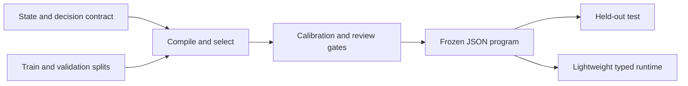

<div align="center">

# Typewright

**Declare a decision. Compile typed Jev questions. Measure them. Ship a JSON program.**

   [](LICENSE)

[Quickstart](#quickstart) · [Declaration](#declare-a-use-case) · [Data](#data-and-evaluation) · [CLI](#command-line) · [Runtime](#python-runtime) · [Hierarchies](#hierarchies) · [Docs](#documentation)

</div>

---

Typewright is a declarative compiler and lightweight runtime for typed Jev
decisions. You describe **state, decisions, and labeled examples**; Typewright
searches within that fixed contract with a DSPy architect and a standalone GEPA
adapter, fits review policy on separate data, and freezes the result into a
checksummed JSON program. Your application loads that program and calls it. It
never needs to know about DSPy internals.

> **Alpha software, with a verification boundary.** The no-key demo and the core
> test suite are executed and pass. The TypeSafe, DSPy, and GEPA integrations are
> implemented against their documented interfaces, but no live provider study has
> been completed, and no measured accuracy gain is claimed. Mock and synthetic
> metrics are pipeline checks, not Jev results. A `measured` artifact is not an
> `approved` one. See [docs/BUILD_REPORT.md](docs/BUILD_REPORT.md) for what was
> actually run.

## How it works



| Declare | Compile | Run |
| --- | --- | --- |
| Define inputs, labels, and decision types in YAML. | Search within a fixed contract and evaluate on separate splits. | Load a frozen program; your code owns side effects. |

DSPy and GEPA are used only at compile time. Importing `typewright` or running a
frozen program does not import either of them.

## Where Typewright fits

DSPy 3.4 added experimental, native Jev support: a `TypeSafe` client behind the
normal `lm=` interface, `Noul`/`Choice`/`Score` output types, and a `ReAnchor`
optimizer. If you want Jev **inside a DSPy program**, use that. Typewright solves a
different problem: getting a decision contract from labeled data to a **reviewed,
budget-bounded, frozen artifact** that an application can run without DSPy.

| Concern | DSPy 3.4 (experimental, per its docs and PRs) | Typewright |
| --- | --- | --- |
| Use Jev in a Python program | Yes: native client, async, and generative LMs mixed in one program. | Not its job. Jev only (mock and TypeSafe backends), no async. |
| Tune decision knobs | `ReAnchor` fits Noul thresholds, Score cuts, and Choice weights. | Fits Noul thresholds and review gates. Score cuts and Choice weights are planned ([#92](https://github.com/Jev-Engineering/TypeWright/issues/92)). |
| Search wording and structure | GEPA over instructions. Program decomposition (via generated code) is in an open upstream PR. | GEPA plus bounded structural proposals as validated JSON. No generated code. |
| Held-out discipline | You supply the data; `ReAnchor` uses folds. | Four disjoint splits with leakage checks; test only after freeze. |
| Review and abstention | None documented. | Fitted review gates with a minimum accepted count and an error constraint; `review_required` on every output. |
| Spend and identity | Not described for the Jev client; accepts aliases like `jev-latest`. | Call budgets, separate paid and teacher-sharing consent, pinned versioned model, failure on identity mismatch. |
| Shipping | A saved DSPy program needs DSPy at runtime. | A checksummed JSON program that runs without DSPy or GEPA. |
| Multi-request graphs and studies | Not provided. | Hierarchy v1 graphs with shared budgets and replayable evidence, and a preregistered study runner. |

These are complementary, not competing, and the comparison is a snapshot of
experimental upstream features that may change. Typewright's structural search and
hierarchies are implemented but **not yet shown to improve accuracy**; the checks
above are about process and safety, not measured gains. Planned alignment with
DSPy: compatibility verification ([#90](https://github.com/Jev-Engineering/TypeWright/issues/90))
and evaluating DSPy's Jev adapter at compile time ([#91](https://github.com/Jev-Engineering/TypeWright/issues/91)).

## Quickstart

Requires Python 3.11 or newer. The base install needs only Pydantic and PyYAML:
no TypeSafe account, DSPy, GEPA, or optimizer model.

**From a source checkout (Windows PowerShell):**

```powershell
python -m venv .venv
.\.venv\Scripts\python.exe -m pip install -e ".[dev]"
.\.venv\Scripts\python.exe -m pytest -q
.\.venv\Scripts\python.exe -m typewright demo --out runs/first-demo
```

**macOS / Linux:**

```bash
python3 -m venv .venv
.venv/bin/python -m pip install -e '.[dev]'
.venv/bin/python -m pytest -q
.venv/bin/python -m typewright demo --out runs/first-demo
```

The demo uses a deterministic lexical mock and makes **no network calls**. Use a
fresh output directory for each run; completed runs are never silently
overwritten. It writes:

```text
runs/first-demo/
  project/                   editable spec and four synthetic data splits
  artifacts/
    program.s1.json          checksummed typed runtime artifact
    questions.json           native Jev question definitions
    report.json              evaluation and accounting
    report.md                readable results
  sample_prediction.json
```

All demo output is marked **synthetic** and runs with `optimizer=none`, so it
tests the pipeline rather than DSPy/GEPA search. A snapshot is checked in at
[`examples/compiled_demo/`](examples/compiled_demo/).

Use `python -m typewright` wherever the `typewright` executable is not on your
`PATH`. The older `s1` and `s1-study` commands remain as deprecated aliases.
`scripts/setup.sh` and `scripts/setup.ps1` automate the steps above (add `--full`
or `-Full` for optional integrations); they never run paid inference.

### Optional integrations

| Extra | Installs | Needed for |
| --- | --- | --- |
| *(base)* | Pydantic, PyYAML | Declarations, demo, frozen runtime with the mock backend |
| `live` | TypeSafe SDK 0.7.0 | Real Jev calls |
| `optimize` | DSPy >=3.3.1,<3.5 (verified 3.3.1 and 3.4.0), GEPA 0.1.4 | Architect, structural search, wording optimization |
| `research` | NumPy, Matplotlib | Benchmark statistics and figures |
| `dev` | pytest, coverage, Ruff, build | Development |

```bash
python -m pip install -e '.[all,dev]'
typewright doctor --check-optional   # checks installed interfaces; never calls a model
```

These pins are integration targets, **not a fully resolved dependency lock**.
Generate a lock in your own verified environment before reproducible live
experiments. See [docs/INTEGRATIONS.md](docs/INTEGRATIONS.md) and
[docs/SOURCES.md](docs/SOURCES.md).

## Declare a use case

A complete example is in
[`examples/support_triage/usecase.yaml`](examples/support_triage/usecase.yaml).
A minimal declaration:

```yaml
name: support_triage
model: jev-1.13.0
state:
  message:
    type: string
  customer_plan:
    type: string
decisions:
  department:
    type: choice
    goal: Route the request to the correct department.
    criteria:
      billing: Payments, charges, invoices, and refunds.
      technical: Malfunctions, errors, and service access problems.
      sales: Product evaluation and purchasing questions.
      other: Requests outside the other categories.
  urgent:
    type: noul
    goal: Detect a current blocking outage or explicitly immediate deadline.
  frustration:
    type: score
    goal: Rate explicitly expressed frustration, not inferred customer value.
    criteria:
      - Calm or neutral.
      - Clearly concerned or dissatisfied.
      - Strongly angry or distressed.
```

| Output type | Meaning |
| --- | --- |
| `choice` | One label from a fixed set, with class probabilities. |
| `noul` | A binary probability, `P(true)`, not a text answer. Quote `"true"` and `"false"` in YAML criteria. |
| `score` | An ordered, zero-indexed scale; three levels span 0 to 2 and may be fractional. |

Criteria are **definitions**, not hand-tuned prompts. The template compiler can
use them directly; the DSPy architect and GEPA optimizer may revise the internal
question wording and rubrics against labeled examples. Choice labels, output
types, Score scale lengths, declared input fields, and the pinned model stay
fixed. Meaning preservation still requires human review and evaluation.

## Data and evaluation

Each JSONL row has `id`, `state`, `expected`, and optionally `group`:

```json
{"id":"ticket-001","group":"account-17","state":{"message":"Please refund a duplicate charge.","customer_plan":"team"},"expected":{"department":"billing","urgent":false,"frustration":0}}
```

Every output needs a label, and compile requires four disjoint splits:

| Split | Used for |
| --- | --- |
| **Train** | Examples and failure traces visible to the architect and proposer. |
| **Validation** | Selecting candidates. Reused repeatedly, so it can be overfit. |
| **Calibration** | Fitting binary thresholds and review gates after prompt selection. |
| **Test** | Evaluated once, after the program and policies are frozen. |

The loader rejects duplicate IDs, exact duplicate projected states, and groups
that cross splits. It cannot detect every semantic near-duplicate, temporal leak,
or mislabeled record, so supply meaningful group IDs yourself. Never feed test
results back into the same optimization run; collect a fresh holdout when you
iterate on test failures.

The search objective combines normalized Brier quality for Choice and Noul with
normalized absolute-error quality for Score, weighted by the declaration.
Reports include accuracy and F1, Brier and log loss, Score error, calibration
diagnostics, review coverage, and descriptive selective-error bounds. Reviewing
everything does not raise the objective.

**Probability is not vendor confidence.** Noul exposes `P(true)`, not a native
confidence field, and a derived review gate is named and described as such.
Weighted numeric composites do not invent a joint posterior. Exact definitions
and the limits of empirical policy fitting are in
[docs/ARCHITECTURE.md](docs/ARCHITECTURE.md).

## Command line

| Command | Purpose |
| --- | --- |
| `typewright init my-use-case` | Create a starter with an editable spec and synthetic data. |
| `typewright draft spec.yaml --out draft.s1.json` | Create a typed template draft without model calls. |
| `typewright compile ...` | Select architecture and wording, fit policy, freeze, then test. |
| `typewright run artifact --state input.json` | Execute a program and return typed decisions. |
| `typewright evaluate artifact --data cases.jsonl --out report.json` | Measure a frozen program without changing it. |
| `typewright harden spec.yaml --data cases.jsonl --out proposals.json` | Propose robustness cases that need label review. |
| `typewright inspect artifact` | Verify the checksum and print the complete typed program. |
| `typewright export-playground artifact --state input.json --out request.json` | Export native state, model, and questions; policies stay local. |
| `typewright schema --out schemas` | Export JSON Schemas for editors and tooling. |
| `typewright doctor --check-optional` | Check installed dependency interfaces without inference. |
| `typewright demo --out runs/demo` | Run the whole pipeline with a no-key synthetic fixture. |
| `typewright-study register/manifest/review/select/test/reconcile/report` | Preregister, review, and replay a three-arm hierarchy comparison. |

Every subcommand has `--help`. The default backend is deliberately **mock**; live
runs must opt in with `--backend typesafe`.

## Using real providers

Everything in this section can spend money or send data to a third party. Run it
only with authorization and suitable data.

Set `TYPESAFE_API_KEY` in your shell or secret manager. Set `S1_TEACHER_MODEL` to
a model identifier supported by your DSPy provider and supply that provider's
credentials locally; Typewright makes no default teacher choice. For a custom
endpoint, `S1_TEACHER_API_BASE` and `S1_TEACHER_API_KEY` are optional overrides.
`.env.example` is a reference, **not** an auto-loaded dotenv file. Never commit
secrets or paste them into logs or chat, and read
[docs/SECURITY.md](docs/SECURITY.md) before using private data.

**Smoke check one call:**

```bash
typewright draft examples/support_triage/usecase.yaml --out runs/live-draft.s1.json
typewright run runs/live-draft.s1.json \
  --state examples/support_triage/sample_state.json \
  --backend typesafe --allow-paid --allow-unvalidated --max-calls 1 --no-cache
```

`--allow-unvalidated` permits experimental execution of an unmeasured draft. It
is not evidence of deployment readiness.

**Compile with DSPy and GEPA** (uploads projected training examples to the
configured teacher; Bash continuations shown, in PowerShell use one line):

```bash
typewright compile examples/support_triage/usecase.yaml \
  --train examples/support_triage/train.jsonl \
  --validation examples/support_triage/validation.jsonl \
  --calibration examples/support_triage/calibration.jsonl \
  --test examples/support_triage/test.jsonl \
  --out runs/live-001 \
  --backend typesafe --allow-paid --share-feedback \
  --architect dspy --optimizer gepa --structural-rounds 1 \
  --teacher-model "$S1_TEACHER_MODEL" \
  --teacher-max-calls 20 --teacher-max-tokens 4096 \
  --max-metric-calls 80 --max-calls 250 \
  --min-calibration-samples 3
```

The calibration minimum above only exercises the tiny example. Use
representative, independently labeled data and a justified sample size for real
decisions; the default minimum of 10 is not a certification of risk.

**Budgets are bounds, not dollar ceilings.** `--max-calls` limits uncached SDK
attempts (SDK retries are disabled). The teacher limit bounds DSPy signature
invocations, not underlying HTTP calls. GEPA's metric-call budget is a separate
search bound. If a budget is exhausted, compilation stops and no artifact is
claimed; the optimizer can also preserve the baseline or fail to improve it.
Costs are reported as `null` when unknown rather than estimated. Configure
provider-side limits as well.

## Python runtime

```python
from typewright import Program, Runtime
from typewright.backends import ManagedBackend, TypeSafeBackend

program = Program.load("runs/live-001/program.s1.json")
backend = ManagedBackend(TypeSafeBackend(allow_paid=True), max_calls=100)
try:
    result = Runtime(program, backend, enforce_release=True).run({
        "message": "Please refund a duplicate charge.",
        "customer_plan": "team",
    })
    # Inspect result["decisions"][name]["review_required"] before acting.
    print(result["decisions"])
finally:
    backend.close()
```

The runtime path never imports DSPy or GEPA. `enforce_release=True` blocks
unmeasured live drafts, but `measured` is not `approved`: artifacts keep
`deployment_approved: false`. Your application owns authorization, human review,
monitoring, and every downstream action. Typewright returns decisions; it does
not move files, merge pull requests, ban users, or act externally.

## Hierarchies

Beyond a single flat request, Typewright supports a separate, versioned **graph**
format: typed routing and dataflow between stages, conditional calls, fan-in, and
bounded nested reuse, executed serially under one shared call budget.

```bash
typewright init my-graph --starter hierarchy
typewright compile my-graph/source.json \
  --train my-graph/train.jsonl --validation my-graph/validation.jsonl \
  --calibration my-graph/calibration.jsonl --test my-graph/test.jsonl \
  --out runs/graph-compile
typewright run runs/graph-compile/hierarchy.s1.json --state my-graph/sample_state.json
typewright inspect runs/graph-compile/hierarchy.s1.json
```

The flat starter remains the default. Evaluating a frozen hierarchy needs the
same four split paths, and `--split` selects which one to measure.
`export-playground` needs `--stage` for a single leaf; a native request cannot
encode the whole graph, and supplied leaf input does not prove the graph would
route there. All starter labels and mock results are synthetic.

Start with the [runnable examples](examples/hierarchy/README.md) (routed support,
advisory PR risk, nested reuse), then the
[artifact guide](docs/HIERARCHY_ARTIFACTS.md), the
[runtime guide](docs/HIERARCHY_RUNTIME.md), the
[migration guide](docs/HIERARCHY_MIGRATION.md), and the
[preregistered flat-versus-hierarchy study](docs/HIERARCHY_STUDY.md).

## Research benchmarks

Two protocols support real-data studies, each separating mock checks from live
results: the [BANKING77 experiment](docs/BANKING77_EXPERIMENT.md), and the
[multi-benchmark suite](docs/RESEARCH_BENCHMARKS.md) covering BoolQ, SST-5,
CLINC150, GoEmotions, and ANLI with audited data preparation, preregistered
comparisons, paired cluster inference, and replayable evidence.

## Scope

**Implemented:** typed declarations and JSON artifacts; a native TypeSafe SDK
adapter; DSPy synthesis and mutation; a standalone GEPA adapter; bounded
add/drop/revise and numeric-decomposition proposals; validation-based selection;
separate empirical policy fitting; projected inputs; request budgets; an optional
sensitive-output cache; reports; schema export; hardening proposals; a no-key
fixture; the hierarchy v1 source and frozen-graph format with strict evidence
replay; and a preregistered study runner.

**Not claimed:** measured hierarchy accuracy gains; a completed independent live
study; production certification; general multi-stage agent orchestration;
arbitrary code generation; MIPRO integration; learned posterior calibration; a
supervised weight fitter; automatic release approval; a TypeScript runtime;
pretrained weights; or a hosted service.

The artifact stays JSON all the way down: no `eval`, generated Python, dynamic
shell, or untrusted pickle loading. Its SHA-256 checksum detects accidental
change but is **not a signature**; an attacker can recompute it.

## Documentation

| Topic | Where |
| --- | --- |
| Architecture, score semantics, policy fitting | [docs/ARCHITECTURE.md](docs/ARCHITECTURE.md) |
| Integrations and sources | [docs/INTEGRATIONS.md](docs/INTEGRATIONS.md), [docs/SOURCES.md](docs/SOURCES.md) |
| Security and data handling | [docs/SECURITY.md](docs/SECURITY.md) |
| Hierarchy contract, data, compilation, evaluation | [docs/HIERARCHY_CONTRACT.md](docs/HIERARCHY_CONTRACT.md), [docs/HIERARCHY_DATA.md](docs/HIERARCHY_DATA.md), [docs/HIERARCHY_COMPILATION.md](docs/HIERARCHY_COMPILATION.md), [docs/HIERARCHY_EVALUATION.md](docs/HIERARCHY_EVALUATION.md) |
| Experiments and benchmarks | [docs/EXPERIMENTS.md](docs/EXPERIMENTS.md), [docs/RESEARCH_BENCHMARKS.md](docs/RESEARCH_BENCHMARKS.md) |
| Build and verification evidence | [docs/BUILD_REPORT.md](docs/BUILD_REPORT.md), [docs/HIERARCHY_RELEASE_VERIFICATION.md](docs/HIERARCHY_RELEASE_VERIFICATION.md) |
| Roadmap and changelog | [docs/ROADMAP.md](docs/ROADMAP.md), [CHANGELOG.md](CHANGELOG.md) |
| Turning a new task into a spec | [prompts/NEW_USE_CASE.md](prompts/NEW_USE_CASE.md) |

### Working with a coding agent

Give a coding agent the repository and paste [`SETUP_PROMPT.md`](SETUP_PROMPT.md).
It installs, inspects, tests, runs the demo, checks optional integrations, and
records what actually worked. It does not authorize paid calls.
[`AGENTS.md`](AGENTS.md) holds the project's engineering rules.

## Development

```bash
python -m pytest -q --cov=typewright --cov-report=term-missing
python -m ruff check src tests examples
python -m build
```

Optional-package tests use real installed packages but no inference, and skip when
a dependency is missing. Test-double adapter tests are labeled separately. CI
configuration covers a core matrix and an optional-contract job; see
[docs/BUILD_REPORT.md](docs/BUILD_REPORT.md) for what was executed during
packaging.

## License and attribution

Released under the [MIT License](LICENSE). Typewright, formerly System One
Compiler, is an independent project and is **not** an official TypeSafe, Jev,
DSPy, or GEPA product. Those names belong to their respective owners and are used
here only to describe compatibility.
